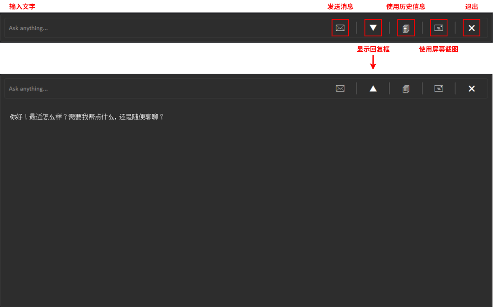

[English](./README.md) | [简体中文](./README.zh-CN.md)
# **1 介绍**

Lotus 是一款基于大语言模型和 OCR 技术、以工作流驱动方式构建的屏幕交互式助手。它旨在通过自然语言交互来提升您的日常电脑使用体验。

# **2 快速开始**
## **2.1 安装与配置**
1. 将整个仓库克隆到本地
2. 在项目根目录下创建 `.env` 文件，并配置本地的 OpenAI API 密钥
3. 运行 `AssistantV2.py` 启动 Lotus

## **2.2 界面布局**

